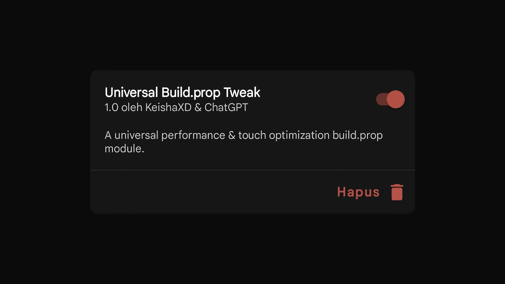

# Universal Buildprop Tweak

Universal Buildprop Tweak is a module or script designed to optimize Android system performance, battery life, and responsiveness by modifying the build.prop file. This tweak is universal, meaning it can be used on various Android devices regardless of brand or model

## Credits :
- Buildprop : I took this buildprop from some people on telegram.
- For filtering : I use Chatgpt to do some filtering to get universal buildprops. 

##  Tested on :
- Realme C21Y (For beta build)
- Infinix Note 30 (For stable build), very smooth in 120hz mode.

## Download :
To download this module, please go to the [Release page](https://github.com/KeishaXD/Universal-Buildprop-Tweak/releases/latest)

## Disclaimer:
Use these modules at your own risk. I am not responsible for any potential damage to your device.